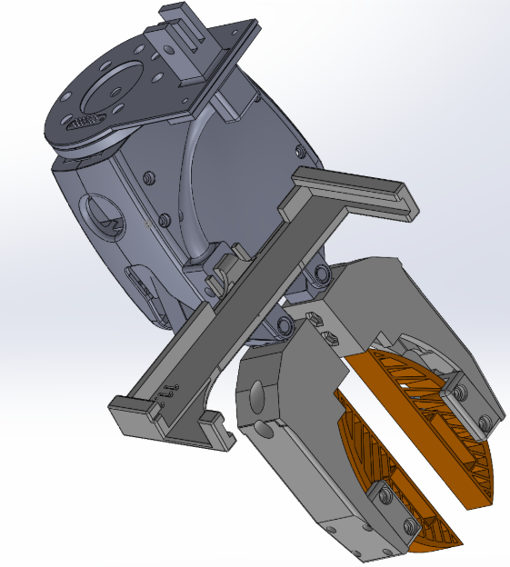
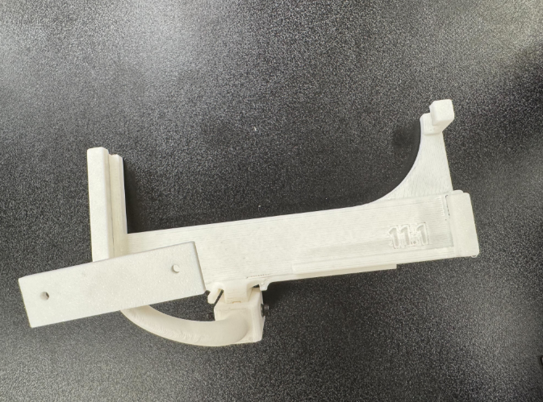
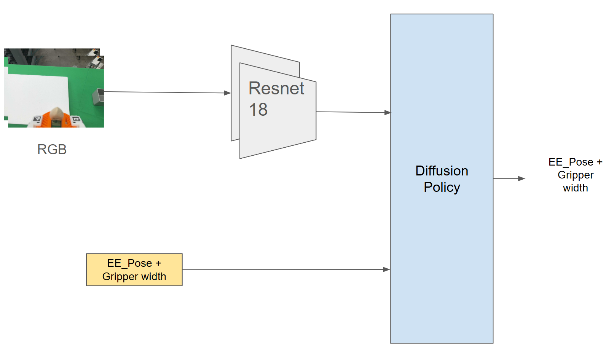
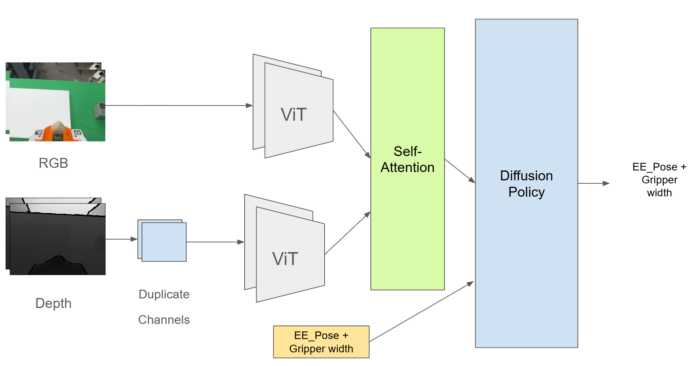

# UMI-Manipulation-in-Construction

Building upon **UMI-FT** (https://github.com/real-stanford/UMI-FT) and its iPhone-based data collection framework, this project establishes an end-to-end workflow for **construction robotics**, spa[...]

Looking ahead, we aim to extend the system to **mobile robotic platforms**, enabling more complex construction manipulation tasks in **dynamic** and **large-scale environments**.

## Hardware Design

For hardware-related files, designs, and supporting materials, please refer to the [Hardware](./Hardware) directory.

  
  

The hardware system is designed to support construction-oriented robotic manipulation tasks in real-world environments. It provides an integrated platform for demonstration collection, policy depl[...]

## Data Collection

### RGBD Demonstration Data Collection

To collect 3D demonstration data, an **iPhone 15 Pro or newer** is required, as these devices provide depth sensing capabilities through the built-in **LiDAR sensor**.

#### Procedure

1. Install the [**Record3D**](https://record3d.app/) application on the iPhone.
2. Launch the application and use the **Record** function to capture demonstrations.
3. Each recording is saved as an `.r3d` file, containing synchronized **RGB images**, **depth data**, and **camera pose information** for downstream processing.

### Data Processing
Refer to the [Data](./Data) directory for data and its processing.

## Trajectory Replay

### Calibration
Refer to the [Calibration](./Software) directory for data and its processing, where also provides [replay](./Software/replay_trajectory.py) of one trajectory.

## Multi-Model

Please check the diffrent [Models](./Software/train) below.

  

The first model is a lightweight baseline trained on 30 demos for comparison. It does not incorporate depth information, and the training and inference results show that it is only capable of completing localized actions.

  

The second model incorporates depth information and partially follows the architecture proposed in the original paper, but does not include tactile sensing. The number of demos is increased to 100.

